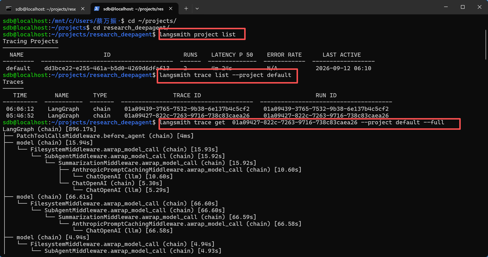

### 1、AgentSeek是什么

AgentSeek 是面向 AI Agent 应用开发生命周期的工具，它通过模板生成、项目任务、环境诊断和统一启动等能力，标准化 Agent 项目的本地开发流程；它本身不负责 Agent 的推理和运行，真正的 Agent 能力由 DeepAgents、LangChain、LangGraph 等框架和运行时提供。

### 2、DeepAgent是什么

一个Agent框架，封装了

### 3、LangSmith是什么



 LangSmith 主要是用于 LLM 和 Agent 应用的可观测性、调试以及评测。因为 Agent 和普通后端不太一样，一次请求内部可能经过 LLM、Tool、Retriever、子 Agent 等多个步骤，只看普通日志其实很难知道具体是哪一步出了问题。

```
一次完整请求
Trace
│
├── Run / Span：Agent 主流程
│
├── Run / Span：Retriever
│
├── Run / Span：LLM Call
│
├── Run / Span：Tool Call
│
└── Run / Span：Parser
```

