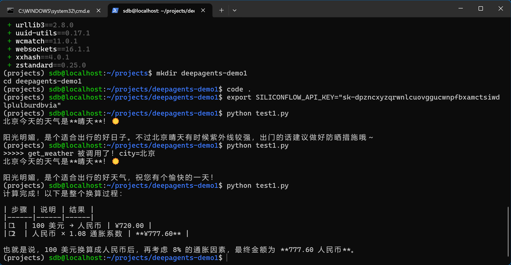
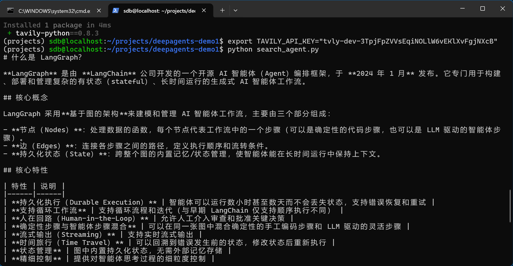
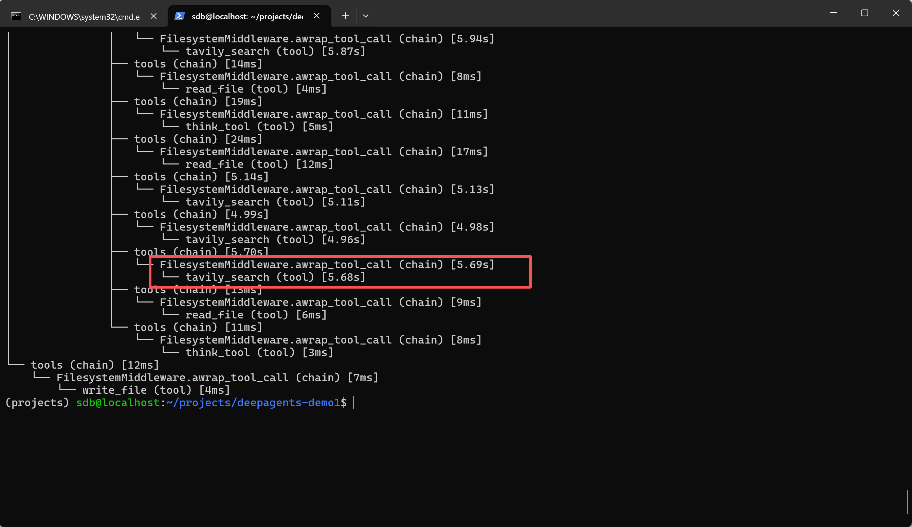

### Agent 开发的三个层次
#### 底层：Agent Runtime  -- langChain
Agent Runtime解决的是Agent如何可靠地运行
包含以下四点：
- 持久化运行
- 流式输出
- 关键点寻求人类批准
- 跨上下文记忆

#### 中间层：Agent Framework  -- langGraph
构建在 Runtime 之上，提供工具接入、模型抽象、Agent循环、中间件等

#### 上层：Agent Harness -- DeepAgent
DeepAgent就是基于这两者之上的产出

### Tool
tool的三要素：
- 参数类型标注：告诉 Agent 每个参数该传什么类型
- Docstring：告诉Agent这个工具的用途
- 默认值：标记哪些参数是可选的

### 实操
详见图片

